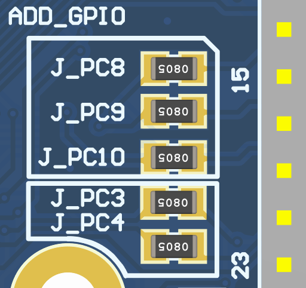
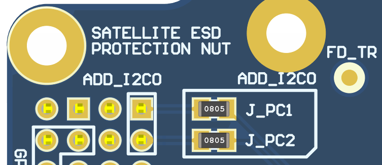
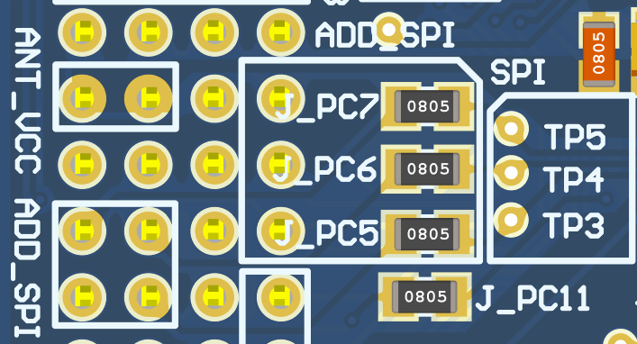

.. assembly.rst

   Copyright The OBDH 2.0 Contributors.

   OBDH 2.0 Documentation

   This work is licensed under the Creative Commons Attribution-ShareAlike 4.0
   International License. To view a copy of this license,
   visit http://creativecommons.org/licenses/by-sa/4.0/.

.. _ch:assembly:

Board Assembly
==============

The OBDH2 has some DNP components to provide flashing, debugging, testing, or extra interfaces if needed. These components may be optional for the flight model of the board. The draftsman document can be viewed for more detailed information regarding their location and board dimensions :cite:`obdh2-draftsman`.

Development Model
-----------------

Debug and programming connectors
~~~~~~~~~~~~~~~~~~~~~~~~~~~~~~~~

The P2 and P6 connectors are used for flashing and debugging the OBDH2 board. See :ref:`sec:programer-and-debug` for more information.

Status leds
~~~~~~~~~~~

As already exposed in the document OBDH2 has status LEDs to be used during the development and test phases. See :ref:`sec:status-leds` for more information.

Flight Model
------------

The flight model of the OBDH 2.0 boards follows a special assembly, some components are not soldered, like the LEDs and some connectors. The PCB is also fabricated with higher quality, using the Class 3 standard and a core material less sensitive to temperature changes. The silkscreen is also not printed on the board.

Custom Configuration
--------------------

On the PC104 connector of OBDH2, there are some jumper resistors to enable extra I2C, SPI, and GPIO interfaces if desired. Note that the I2C0, I2C1, and SPI channels should not be used with shared devices. These components’ corresponding tables and locations on the PCB are shown on :numref:`tab:additional-pc104-inferfaces` and Figures :numref:`fig:add_gpio_i2c1_jumpers`, :numref:`fig:add_i2c0_jumpers` and :numref:`fig:add_spi_1gpio_jumpers`.

.. table:: Additional PC104 inferfaces.
   :name: tab:additional-pc104-inferfaces
   :widths: 25 25
   :align: center

   ========= =============
   **Label** **Interface**
   ========= =============
   J_PC1     I2C0_SDA
   J_PC2     I2C0_SCL
   J_PC3     I2C1_SDA
   J_PC4     I2C1_SCL
   J_PC5     SPI_MOSI
   J_PC6     SPI_MISO
   J_PC7     SPI_CLK
   J_PC8     GPI0
   J_PC9     GPIO1
   J_PC10    GPIO2
   J_PC11    GPIO3
   ========= =============

   Additional GPIOs and I2C channel 1.

   Additional I2C channel 0.

   Additional GPIO and SPI channel.
