.. hardware.rst

   Copyright The OBDH 2.0 Contributors.

   OBDH 2.0 Documentation

   This work is licensed under the Creative Commons Attribution-ShareAlike 4.0
   International License. To view a copy of this license,
   visit http://creativecommons.org/licenses/by-sa/4.0/.

.. _ch:hardware:

Hardware
========

The OBDH 2.0 architecture focuses on the low-power operation and low-cost production, maintaining performance and proposing different approaches to increase overall reliability. Therefore, the board was developed using these criteria, and the changes from the original design were necessary to improve bottlenecks and achieve the requirements of the further space mission. The :numref:`fig:block-diagram` presents the module architecture from the hardware perspective, including the main PCB components and interfaces: microcontroller, buffers, transceivers, memory, watchdog and voltage monitor, and connectors. The following sections describe the hardware design, interfaces, and standards in detail. The Figures :numref:`fig:pcb-top`, :numref:`fig:pcb-bottom`, and :numref:`fig:pcb-side` present 3D-rendered images of the top, bottom, and side views of the board, respectively.

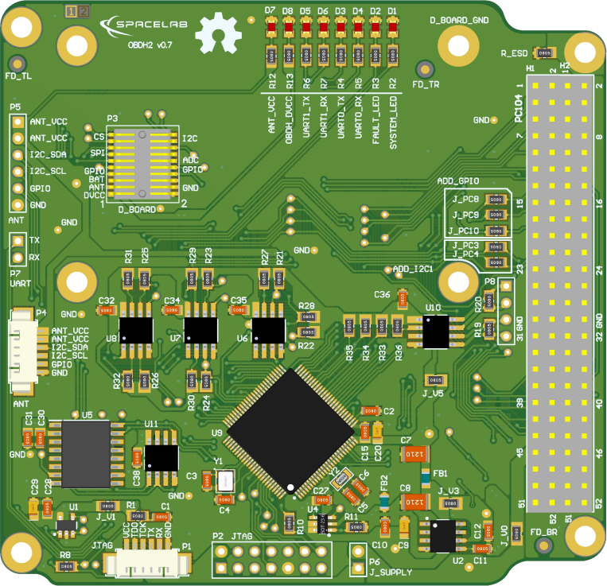

   Top side of the PCB.

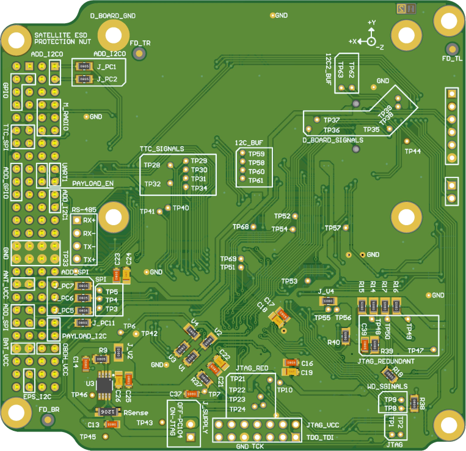

   Bottom side of the PCB.

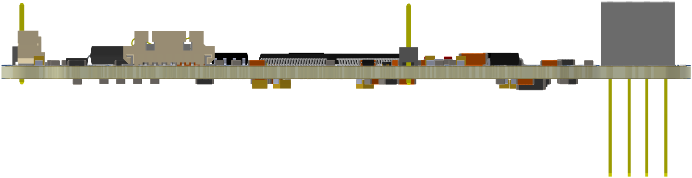

   Side view of the PCB.

Interfaces
----------

The :numref:`fig:diagram-interfaces` presents the board interfaces, which consist of communication with other modules, debug access points, and internal peripherals. From the perspective of the microcontroller, there are 6 individual and shared communication buses and the JTAG interface in the following scheme: A0-SPI (shared with Radio, TTC, and external memory chip); A1-UART (shared with redundant payloads); A2-UART (dedicated for debugging); B0-I2C (dedicated for the payload); B1-I2C (dedicated for the EPS); B2-I2C (dedicated for the Antenna module). Currently, “*Payload 1*” and “*Payload 2*” are “*Radiation instrument*” and “*Payload EDC*” respectively.

.. figure:: img/diagram_interfaces.*
   :align: center
   :name: fig:diagram-interfaces

   Interfaces diagram.

.. container::

   .. table:: Boards interfaces.
      :name: tab:interfaces
      :widths: 28 12 22 38

      ===================== ======== ================== ===================
      **Peripheral**        **USCI** **Protocol**       **Comm. Protocol**
      ===================== ======== ================== ===================
      TTC                   A0       SPI                Register read/write
      Radio (downlink/link) A0       SPI                Radio config./NGHam
      NOR Memory            A0       SPI                \-
      FRAM Memory           A0       SPI                \-
      Payload port          A1       UART               \-
      PC (log messages)     A2       UART               ANSI messages
      Payload port          B0       I\ :math:`^{2}`\ C \-
      EPS                   B1       I\ :math:`^{2}`\ C Register read/write
      Antenna Module        B2       I\ :math:`^{2}`\ C \-
      ===================== ======== ================== ===================

External Connectors
-------------------

The external interfaces are connected to the microcontroller using different connector types: EPS, TTC, Radio, and Payloads through PC-104; Antenna module with 6H header and 6P picoblade connectors; JTAG through 14H header and 6P picoblade connectors; and debug access using a dedicated 2H header and shared with the JTAG connectors. The following topics describe these interfaces and present the pinout of the connectors.

.. _sec:pc104:

PC-104
~~~~~~

The connector PC-104 is a junction of two double-row 28H headers (*SSW-126-04-G-D*). These connectors create a solid 104-pin interconnection across the different satellite modules. The :numref:`fig:pc-104-scheme` shows the PC-104 interface from the bottom side of the PCB, which allows visualizing the simplified label scheme in the board. Also, the :numref:`tab:pc104-pins` provides the connector pinout [1]_ for the pins that are connected to the module.

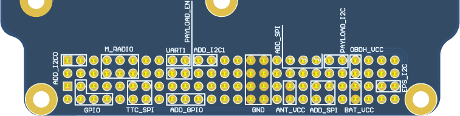

   Bottom view of PC-104 and simplified labels

.. container::

   .. table:: PC-104 connector pinout.
      :name: tab:pc104-pins
      :widths: 12 22 22 22 22

      ============= ========== ========== =========== ===========
      **Pin [A-B]** **H1A**    **H1B**    **H2A**     **H2B**
      ============= ========== ========== =========== ===========
      1-2           \-         \-         \-          \-
      3-4           \-         \-         GPIO_4      GPIO_5
      5-6           \-         \-         \-          \-
      7-8           GPIO_0     GPIO_1     \-          GPIO_6
      9-10          GPIO_2     \-         \-          \-
      11-12         GPIO_3     GPIO_7     SPI_0_MOSI  SPI_0_CLK
      13-14         \-         \-         SPI_0_CS_1  SPI_0_MISO
      15-16         \-         \-         \-          \-
      17-18         UART_1_RX  GPIO_8     \-          \-
      19-20         UART_1_TX  GPIO_9     \-          \-
      21-22         \-         \-         \-          \-
      23-24         \-         \-         \-          \-
      25-26         \-         \-         \-          \-
      27-28         \-         \-         \-          \-
      29-30         GND        GND        GND         GND
      31-32         GND        GND        GND         GND
      33-34         \-         \-         \-          \-
      35-36         SPI_0_CLK  \-         VCC_3V3_ANT VCC_3V3_ANT
      37-38         SPI_0_MISO \-         \-          \-
      39-40         SPI_0_MOSI SPI_0_CS_0 \-          \-
      41-42         I2C_0_SDA  \-         \-          \-
      43-44         I2C_0_SCL  \-         \-          \-
      45-46         VCC_3V3    VCC_3V3    VCC_BAT     VCC_BAT
      47-48         \-         \-         \-          \-
      49-50         \-         \-         I2C_1_SDA   \-
      51-52         \-         \-         I2C_1_SCL   \-
      ============= ========== ========== =========== ===========

Antenna Module
~~~~~~~~~~~~~~

The communication with the Antenna module is performed through the external connectors presented in :numref:`fig:ant-connectors`. The P5 connector (6H header) is used for development, while P4 (6P PicoBlade) is used for the flight model. Both connectors provide the same dedicated I2C, power-supply, and GPIO interface described in :numref:`tab:antenna-connector-pins`.

.. container:: compacttable55

   .. table:: Antenna module connectors pinout.
      :name: tab:antenna-connector-pins
      :widths: 20 80

      ======= ===========
      **Pin** **Row**       
      ======= ===========
      1       VCC_3V3_ANT   
      2       VCC_3V3_ANT   
      3       I2C_SDA       
      4       I2C_SCL       
      5       GPIO          
      6       GND           
      ======= ===========

.. subfigure:: AB
   :layout-sm: A|B
   :gap: 8px
   :subcaptions: below
   :name: fig:ant-connectors

   .. image:: img/p5-connector.png
      :align: center
      :alt: Debug interface of the antenna module.
      :width: 50.0%

   .. image:: img/p4-connector.png
      :align: center
      :alt: Main interface of the antenna module.
      :width: 50.0%

   Antenna module connectors: development header (left) and flight-model PicoBlade (right).

.. _sec:programer-and-debug:

Programmer and Debug
~~~~~~~~~~~~~~~~~~~~

The interface with the microcontroller programmer is performed through external connectors, which are presented in the :numref:`fig:jtag-connectors`. Both connectors have the same JTAG and UART interfaces. However, the 14H header is used during development, and the 6P picoblade (provides a more compact and reliable attachment) as the connector for the flight model, which is described in the :numref:`tab:jtag-header-connector-pins` and :numref:`tab:jtag-picoblade-connector-pins`, respectively. This interface consists of a dedicated debug UART, a JTAG, and an external power supply. The debug UART connection has another access point in a dedicated 2H header (P7), as shown in :numref:`fig:uart-debug-connector`. Also, to use this external supply, it is necessary to connect both pins of a 2H header jumper (P6).

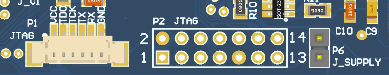

   Programmer (P1 and P2) and jumper (P6) connectors.

.. container:: compacttable60

   .. table:: Programmer header connector pinout.
      :name: tab:jtag-header-connector-pins
      :widths: 30 35 35

      ============= ========= =========
      **Pin [A-B]** **Row A** **Row B**  
      ============= ========= =========
      1-2           TDO_TDI   VCC_3V3    
      3-4           \-        \-         
      5-6           \-        \-         
      7-8           TCK       \-         
      9-10          GND       \-         
      11-12         \-        UART_TX    
      13-14         \-        UART_RX    
      ============= ========= =========

.. container:: compacttable65

   .. table:: Programmer picoblade connector pinout.
      :name: tab:jtag-picoblade-connector-pins
      :widths: 20 80

      ======= =======
      **Pin** **Row**   
      ======= =======
      1       VCC_3V3   
      2       TDO_TDI   
      3       TCK       
      4       UART_TX   
      5       UART_RX   
      6       GND       
      ======= =======

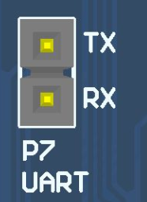

   Dedicated UART debug connectors (P7).

.. _sec:daughterboard-interface:

Daughterboard
~~~~~~~~~~~~~

The daughterboard interface uses the Samtec FSI-110-D connector :cite:`fsi-conn`, which can be seen in the :numref:`fig:samtec-connector`. This connector has metal contacts in the format of flexible arcs and four polymer guide pins (a pair for the top and bottom). When the daughterboard is attached, there is some pressure on the metal contacts that bend and create a meaningful pin connection to the daughterboard copper pads [2]_. A picture of this connector on the PCB can be seen in :numref:`fig:daughterboard-connector`.

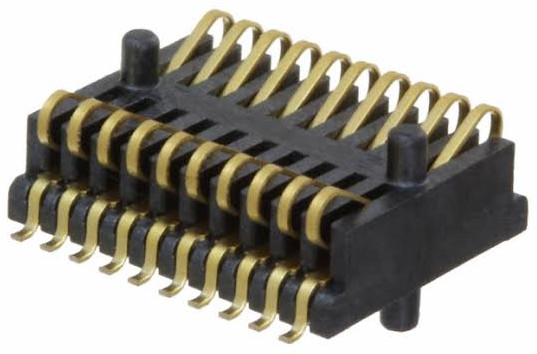

   Samtec FSI-110-03-G-D-AD connector.

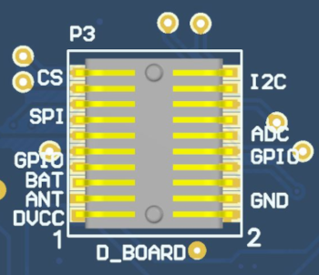

   Daughterboard connector (P3).

The pinout of the daughterboard interface is available in the :numref:`tab:daugtherboard-connector-pins`. There are different power supply lines (OBDH, Antenna, and battery), communication buses (I2C and SPI), GPIO, and ADC interfaces available. Besides the GPIO and ADC pins, the other interfaces are shared with other modules and peripherals.

.. container:: compacttable65

   .. table:: Daughterboard connector pinout.
      :name: tab:daugtherboard-connector-pins
      :widths: 30 35 35

      ============= =========== =========
      **Pin [A-B]** **Row A**   **Row B**  
      ============= =========== =========
      1-2           VCC_3V3     GND        
      3-4           VCC_3V3_ANT GND        
      5-6           VCC_BAT     GND        
      7-8           GPIO_0      GPIO_1     
      9-10          GPIO_2      GPIO_3     
      11-12         SPI_0_CLK   ADC_0      
      13-14         SPI_0_MISO  ADC_1      
      15-16         SPI_0_MOSI  ADC_2      
      17-18         SPI_0_CS_0  I2C_2_SDA  
      19-20         SPI_0_CS_1  I2C_2_SCL  
      ============= =========== =========

Guidelines
^^^^^^^^^^

The recommended shape and size of the daughterboard can be seen in the :numref:`fig:daughterboard-size`. Besides that, there are mandatory and suggested elements placement: four M3 holes for mechanical attachment, required; contact connector pads (in light gray on the bottom layer), required; two debug headers on the left and bottom sides, suggested; and a general purpose flight model picoblade suggested.

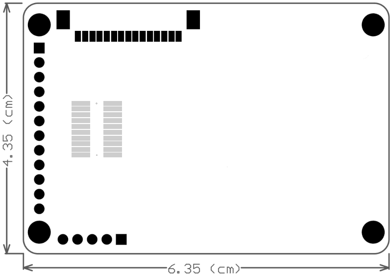

   Recommended shape and size of the daughterboard.

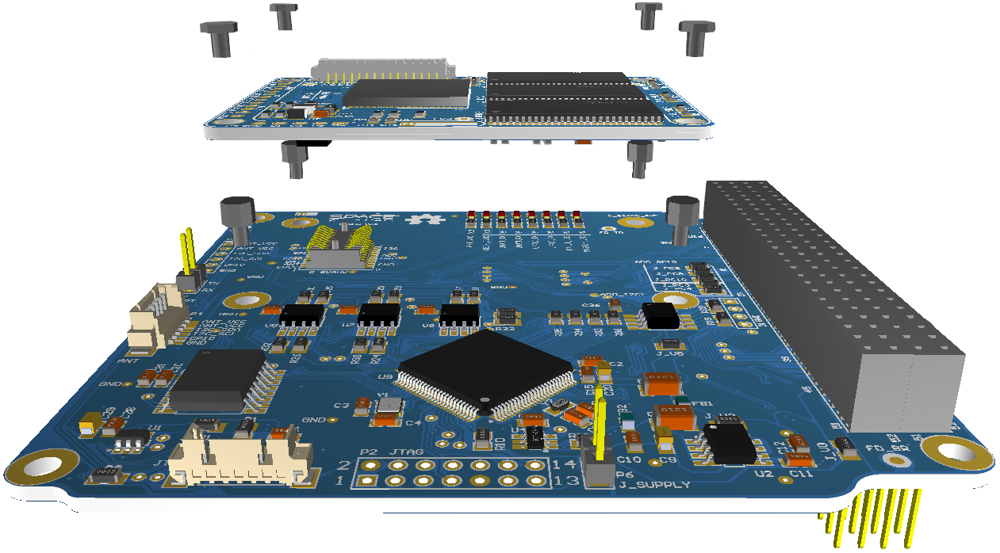

   Illustrative daughterboard integration.

Microcontroller
---------------

The OBDH 2.0 uses a low-power and low-cost microcontroller family from Texas Instruments; the MSP430F6659 :cite:`msp430f6659`. This device provides sufficient performance for low and medium-complexity software and algorithms, allowing the module to execute the required tasks. The :numref:`tab:msp430-summary` presents a summary of the main available features and :numref:`fig:msp430-diagram` shows the internal subsystems, descriptions, and peripherals. The microcontroller interfaces, configurations, and auxiliary components are described in the following topics.

.. container::

   .. table:: Microcontroller features summary.
      :name: tab:msp430-summary
      :widths: 12 12 12 28 12 12 12

      +-----------+----------+------------+----------------------+---------+---------+----------+
      | **Flash** | **SRAM** | **Timers** | **USCI**             | **ADC** | **DAC** | **GPIO** |
      +===========+==========+============+======================+=========+=========+==========+
      | 512KB     | 64KB     | 2          | 6 (SPI / I2C / UART) | 12      | 2       | 74       |
      +-----------+----------+------------+----------------------+---------+---------+----------+

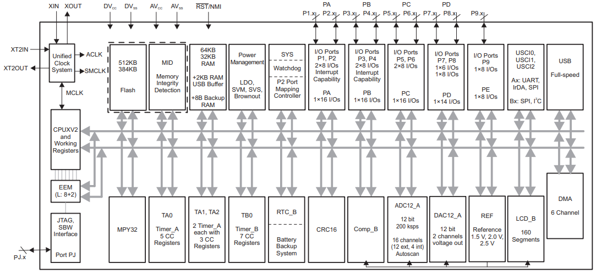

   Microcontroller internal diagram.

Interfaces Configuration
~~~~~~~~~~~~~~~~~~~~~~~~

The microcontroller has 6 Universal Serial Communication Interfaces (USCI) that can be configured to operate with different protocols and parameters. These interfaces are connected to different modules and peripherals, as presented in the :numref:`fig:diagram-interfaces`. The :numref:`tab:usci-config` describes each interface configuration.

.. container::

   .. table:: USCI configuration.
      :name: tab:usci-config
      :widths: 14 20 12 18 16 20

      +---------------+----------------------+----------+-----------------+---------------+-------------------+
      | **Interface** | **Protocol (Index)** | **Mode** | **Word Length** | **Data Rate** | **Configuration** |
      +===============+======================+==========+=================+===============+===================+
      | USCI_A0       | SPI                  | Master   | 8 bits          | 1 Mbps        | Phase: High       |
      +---------------+----------------------+----------+-----------------+---------------+-------------------+
      |               |                      |          |                 |               | Polarity: Low     |
      +---------------+----------------------+----------+-----------------+---------------+-------------------+
      | USCI_A1       | UART1                | \-       | 8 bits          | 115200 bps    | Stop bits: 1      |
      +---------------+----------------------+----------+-----------------+---------------+-------------------+
      |               |                      |          |                 |               | Parity: None      |
      +---------------+----------------------+----------+-----------------+---------------+-------------------+
      | USCI_A2       | UART0                | \-       | 8 bits          | 115200 bps    | Stop bits: 1      |
      +---------------+----------------------+----------+-----------------+---------------+-------------------+
      |               |                      |          |                 |               | Parity: None      |
      +---------------+----------------------+----------+-----------------+---------------+-------------------+
      | USCI_B0       | I2C0                 | Master   | 8 bits          | 100 kbps      | Adr. len: 7 bits  |
      +---------------+----------------------+----------+-----------------+---------------+-------------------+
      | USCI_B1       | I2C1                 | Master   | 8 bits          | 100 kbps      | Adr. len: 7 bits  |
      +---------------+----------------------+----------+-----------------+---------------+-------------------+
      | USCI_B2       | I2C2                 | Master   | 8 bits          | 100 kbps      | Adr. len: 7 bits  |
      +---------------+----------------------+----------+-----------------+---------------+-------------------+

Clocks Configuration
~~~~~~~~~~~~~~~~~~~~

Besides the internal clock sources, the microcontroller has two dedicated clock inputs for external crystals: the main clock and the auxiliary. A :math:`32\ MHz` crystal and a :math:`32.769\ kHz` are connected to these inputs. The first source is used for generating the Master Clock (MCLK) and the Subsystem Master Clock (SMCLK), which are used by the CPU and the internal peripheral modules. The second source is used for generating the Auxiliary Clock (ACLK) that handles the low-power modes and might be used for peripherals.

Pinout
~~~~~~

An illustration of the microcontroller pinout positions can be seen in the :numref:`fig:msp430-pinout-positions`. The :numref:`tab:mcu-pinout` presents the OBDH 2.0 microcontroller pins assignment.

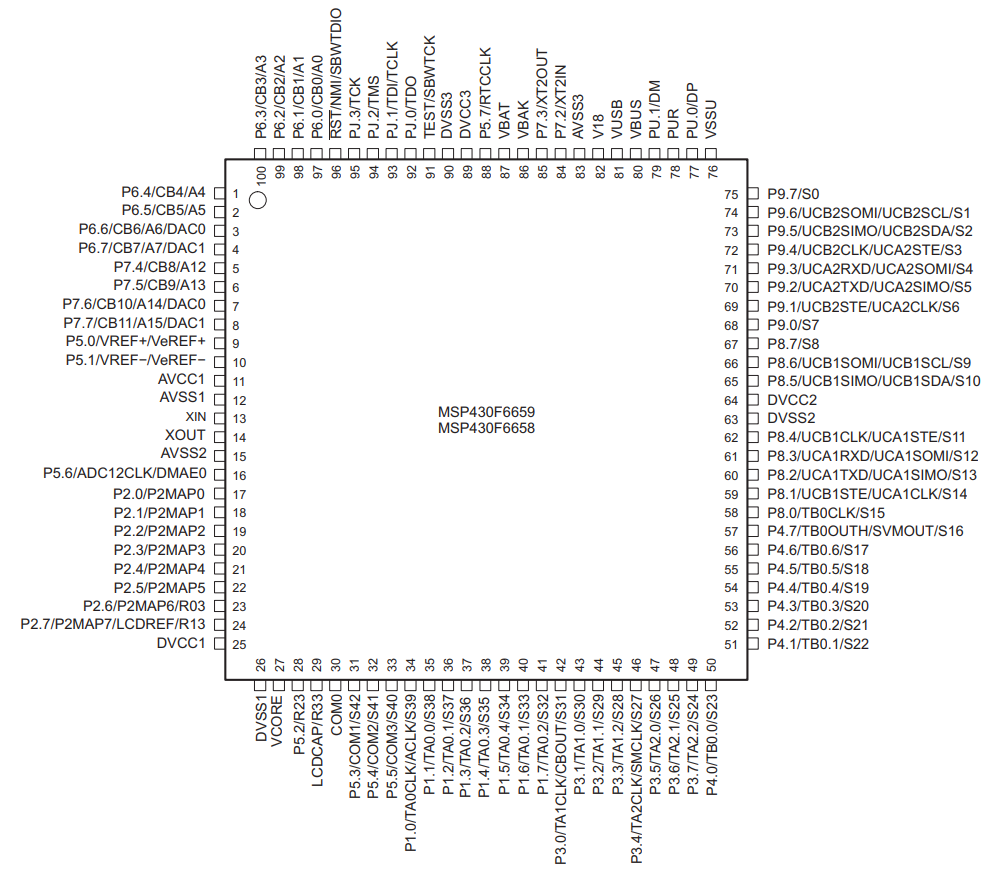

   Microcontroller pinout positions.

.. container::

   .. table:: Microcontroller pinout and assignments.
      :name: tab:mcu-pinout
      :widths: 15 15 70

      ============ ============== =================
      **Pin Code** **Pin Number** **Signal**
      ============ ============== =================
      P1.0         34             MAIN_RADIO_ENABLE
      P1.1         35             MAIN_RADIO_GPIO0
      P1.2         36             MAIN_RADIO_GPIO1
      P1.3         37             MAIN_RADIO_GPIO2
      P1.4         38             MAIN_RADIO_RESET
      P1.5         39             MAIN_RADIO_SPI_CS
      P1.6         40             TTC_MCU_SPI_CS
      P1.7         41             \-
      P2.0         17             SPI_CLK
      P2.1         18             I2C0_SDA
      P2.2         19             I2C0_SCL
      P2.3         20             \-
      P2.4         21             SPI_MOSI
      P2.5         22             SPI_MISO
      P2.6         23             VERSION_BIT0
      P2.7         24             VERSION_BIT1
      P3.0         42             I2C0_EN
      P3.1         43             I2C1_EN
      P3.2         44             I2C2_EN
      P3.3         45             I2C0_READY
      P3.4         46             I2C1_READY
      P3.5         47             I2C2_READY
      P3.6         48             PC104_GPIO0
      P3.7         49             PC104_GPIO1
      P4.0         50             PC104_GPIO2
      P4.1         51             PC104_GPIO3
      P4.2         52             MEM_HOLD
      P4.3         53             MEM_RESET
      P4.4         54             MEM_SPI_CS
      P4.5         55             PC104_GPIO4
      P4.6         56             PC104_GPIO5
      P4.7         57             PC104_GPIO6
      P5.0         9              VREF
      P5.1         10             AGND
      P5.2         28             SYSTEM_FAULT_LED
      P5.3         31             SYSTEM_LED
      P5.4         32             PAYLOAD_0_ENABLE
      P5.5         33             PAYLOAD_1_ENABLE
      P5.6         16             \-
      P5.7         88             \-
      P6.0         97             D_BOARD_ADC0
      P6.1         98             D_BOARD_ADC1
      P6.2         99             D_BOARD_ADC2
      P6.3         100            OBDH_CURRENT_ADC
      P6.4         1              OBDH_VOLTAGE_ADC
      P6.5         2              D_BOARD_SPI_CS0
      P6.6         3              D_BOARD_SPI_CS1
      P6.7         4              \-
      P7.0         \-             \-
      P7.1         \-             \-
      P7.2         84             XT2_N
      P7.3         85             XT2_P
      P7.4         5              D_BOARD_GPIO0
      P7.5         6              D_BOARD_GPIO1
      P7.6         7              D_BOARD_GPIO2
      P7.7         8              D_BOARD_GPIO3
      P8.0         58             \-
      P8.1         59             \-
      P8.2         60             UART1_TX
      P8.3         61             UART1_RX
      P8.4         62             \-
      P8.5         65             I2C1_SDA
      P8.6         66             I2C1_SCL
      P8.7         67             ANTENNA_GPIO
      P9.0         68             FRAM_WP
      P9.1         69             FRAM_SPI_CS
      P9.2         70             UART0_TX
      P9.3         71             UART0_RX
      P9.4         72             WDI_EXT
      P9.5         73             I2C2_SDA
      P9.6         74             I2C2_SCL
      P9.7         75             MR_WDOG
      PJ.0         92             TP21
      PJ.1         93             TP22
      PJ.2         94             TP23
      PJ.3         95             TP24
      \-           13             XT1IN
      \-           14             XT1OUT
      \-           96             JTAG_TDO_TDI
      \-           91             JTAG_TCK
      ============ ============== =================

External Watchdog
-----------------

In addition to the internal watchdog timer of the microcontroller, to ensure a system reset in case of a software freeze, an external watchdog circuit is being used. For that, the TPS3823 IC from Texas Instruments :cite:`tps382x` was chosen. This IC is a voltage monitor with a watchdog timer feature. This circuit can be seen in the :numref:`fig:ext-wdt-circuit`.

This circuit works this way: if the WDI pin remains high or low longer than the timeout period, then reset is triggered. The timer clears when reset is asserted or when WDI sees a rising or falling edge.

The watchdog timer task clears the TPS3823 timer by toggling the WDI pin every :math:`100\ ms`. If the WDI pin state stays unmodified for more than :math:`1600\ ms`, the reset pin is cleared, and the microcontroller is reset.

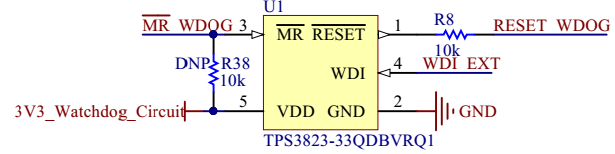

   External watchdog timer circuit.

Non-Volatile Memories
---------------------

There are two non-volatile memories available on the module: one flash NOR memory and one FRAM memory.

Flash NOR
~~~~~~~~~

The flash NOR non-volatile memory model is the Micron MT25QL01GBBB, which is composed of a NOR flash architecture with 1 Gb of capacity (or 128 MB) and features extended SPI configurations. As seen in :numref:`fig:diagram-interfaces`, an SPI bus is used to communicate with this peripheral, using the :numref:`tab:usci-config` configurations. Also, some control pins are connected to microcontroller GPIOs: HOLD#, RESET#, and W#.

When RESET# is driven LOW, the device is reset, and the outputs are tri-stated. The HOLD# signal pauses serial communications without deselecting or resetting the device; outputs are tri-stated, and inputs are ignored. The W# signal handles as write protection, freezes the status register, turning its non-volatile bits read-only and preventing the write operation from being executed.

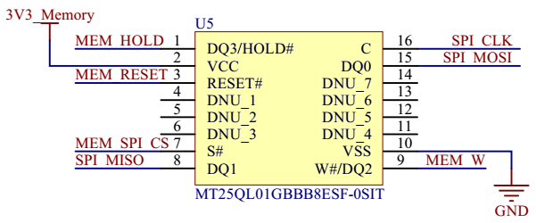

   External memory circuit.

FRAM
~~~~

The EXCELON™ Auto CY15X102QN is an automotive grade, 2Mb non-volatile memory employing an advanced ferroelectric process. A ferroelectric random access memory or F-RAM is non-volatile and performs reads and writes similar to RAM. It provides reliable data retention for 121 years. The schematics of the memory can be seen in :numref:`fig:fram-mem-circuit`, an SPI bus is used to communicate with this peripheral.

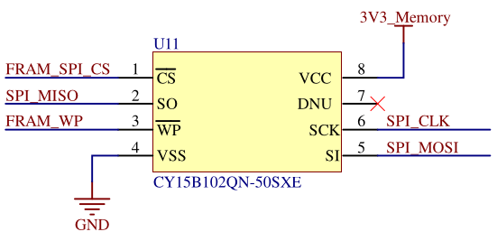

   FRAM memory circuit.

I2C Buffers
-----------

The microcontroller I2C interfaces have dedicated IC buffers, which improve the signal quality throughout the various connectors and offer reliability enhancements since it protects the bus in case of failures. This measure was adopted in all the satellite modules due to previous failures in I2C buses. Using this scheme, the modules connected through this protocol might have shared connections without losing performance or reliability.

The buffer selected for this function is the Texas Instruments TCA4311 device. Besides the I2C inputs and outputs, it features control and status signals that are connected to GPIOs in the microcontroller: an enable and an operation-ready status. Also, both inputs and outputs in these I2C lines have external pull-up resistors.

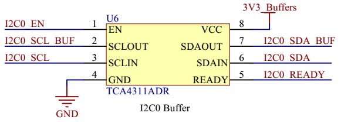

   I2C buffer circuit.

RS-485 Transceiver
------------------

The module features an RS-485 interface connected to a 4H header (P8). This interface uses a transceiver (THVD1451) to convert the incoming RS-485 signals to UART and vice-versa. The outputs are :math:`120\ \Omega` differential pairs that have termination resistors before connecting to the header pins.

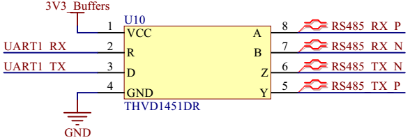

   RS-485 transceiver circuit.

Voltage and Current Sensors
---------------------------

To monitor the board’s overall current and voltage, the module has a current sensor using a Maxim Integrated IC (MAX9934) and a buffered voltage divider circuit with a Texas Instruments IC (TLV341A). These circuits have direct analog outputs that are connected to ADC inputs. The microcontroller’s internal ADC peripheral has a dedicated input for a voltage reference, which is connected to the REF5030A IC. This device generates a precise :math:`3\ V` output that enhances the measures and conversions performed by the microcontroller.

.. [1]
   This pinout is simplified since additional interfaces were omitted. Refer to *option sheet* in chapter :ref:`ch:assembly`.

.. [2]
   These daughterboard pads are similar to the ones used as a footprint in the OBDH, despite a slightly bigger size.
