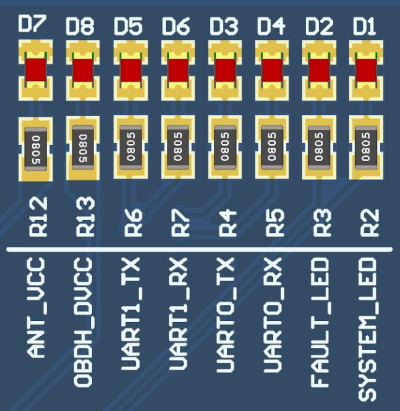

.. system_overview.rst

   Copyright The OBDH 2.0 Contributors.

   OBDH 2.0 Documentation

   This work is licensed under the Creative Commons Attribution-ShareAlike 4.0
   International License. To view a copy of this license,
   visit http://creativecommons.org/licenses/by-sa/4.0/.

.. _ch:system-overview:

System Overview
===============

The board has an MSP430 low-power microcontroller that runs the firmware application and several other peripherals for extended operation and physical interfaces (i.e., non-volatile memory, watchdog timer, service modules, payloads interfaces, daughterboard interface, and current monitor). The microcontroller manages the other sub-modules within the board using serial communication buses, synchronizes actions, handles communication with the ground segment, and manages the data flow. The programming language used is C, and the firmware was developed using the Code Composer Studio IDE (a.k.a. CCS) for compiling, programming and testing. The module has many tasks over distinct protocols and time requirements, such as interfacing peripherals and other MCUs. To improve predictability, a Real-Time Operating System (RTOS) is used to ensure that the deadlines are observed, even under a faulty situation in a routine. The RTOS chosen is the FreeRTOS (v10.0.0), since it is designed for embedded systems applications and was already validated in space applications. The firmware architecture follows an abstraction layer scheme to facilitate higher-level implementations and allow more portability across different hardware platforms.

Product tree
------------

The product tree of the OBDH 2.0 module is available in :numref:`fig:product-tree`.

.. figure:: img/product-tree.*
   :align: center
   :name: fig:product-tree
   :width: 80.0%

   Product tree of the OBDH 2.0 module.

Block Diagram
-------------

:numref:`fig:block-diagram` presents a simplified view of the module subsystems and interfaces. The microcontroller has a programming JTAG and 6 communication buses, divided into 3 different protocols (I2C, SPI, and UART), that is shared between all the peripherals and external interfaces. Besides these channels, there are GPIO connections for various functions, from control ports to status pins. There is a non-volatile memory device to store the satellite data frames and critical status indicators. Some buffers and transceivers allow secure and proper communication with external modules. A watchdog timer with a voltage monitor and a current sensor is attached to the system to improve the overall reliability and generate essential housekeeping data. There is a generic daughterboard interface for extending the module capabilities with an auxiliary application board. Also, a UART debug interface is directly connected to the microcontroller. More details and descriptions about these components and interfaces are provided in :ref:`ch:hardware`.

.. figure:: img/block_diagram.*
   :align: center
   :name: fig:block-diagram

   OBDH 2.0 Block diagram.

System Layers
-------------

As mentioned, the system is divided into abstraction layers to favor high-level firmware implementations. The :numref:`fig:system-layers` shows this scheme, composed of third-party drivers at the lowest layer above the hardware, the operating system as the base building block of the module, the devices handling implementation, and the application tasks in the highest layer. More details are provided in :ref:`ch:firmware`.

.. figure:: img/system_layers.*
   :align: center
   :name: fig:system-layers
   :width: 40.0%

   System layers.

Operation
---------

The system operates through the sequential execution of routines (tasks in the context of the operating system) that are scheduled and multiplexed over time. Each routine has a priority and a periodicity, determining the subsequent execution, the set of functionalities currently running, and the memory usage management. Besides this deterministic scheduling system, the routines have communication channels with each other through the usage of queues and task notifications, which provides a robust synchronization scheme. In :ref:`ch:firmware` the system operation and the internal nuances are described in detail. Then, this section uses a top-view user perspective to describe the module operation.

Execution Flow
~~~~~~~~~~~~~~

The OBDH 2.0 execution flowchart can be seen on :numref:`fig:flowchart_OBDH`.

.. figure:: img/flowchart_OBDH.*
   :align: center
   :name: fig:flowchart_OBDH
   :width: 60.0%

   OBDH 2.0 operation flowchart

The boot sequence can be seen better on :numref:`fig:flowchart_obdh_boot_sequence`.

.. figure:: img/flowchart_obdh_boot_sequence.*
   :align: center
   :name: fig:flowchart_obdh_boot_sequence
   :width: 20.0%

   OBDH’s 2.0 boot sequence.

The antenna deploy routine is exemplified with the flowchart on :numref:`fig:flowchart_antenna_deploy_routine`.

.. figure:: img/flowchart_antenna_deploy_routine.*
   :align: center
   :name: fig:flowchart_antenna_deploy_routine
   :width: 45.0%

   Antenna deploy routine

The Telecommand’s processing flowchart can be seen on :numref:`fig:tc-flowchart`.

.. figure:: img/tc_processing_flow.*
   :align: center
   :name: fig:tc-flowchart
   :width: 75.0%

   Telecommand’s processing flowchart

Data Flow
~~~~~~~~~

The OBDH 2.0 controls most of the CubeSat’s data flow, which can be seen on :numref:`fig:data-path-diagram`.

.. figure:: img/data_path_diagram.*
   :align: center
   :name: fig:data-path-diagram

   Data path diagram.

.. _sec:status-leds:

Status LEDs
~~~~~~~~~~~

On the development version of the board, eight LEDs indicate some behaviors of the systems. This set of LEDs can be seen on :numref:`fig:status-leds`.

   Available status LEDs.

A description of each of these LEDs are available below:

- **D1 - System LED**: Heartbeat of the system. Blinks at a frequency of 1 Hz when the system is running properly.

- **D2 - Fault LED**: Indicates a critical fault in the system.

- **D3 - UART0 TX**: Blinks when data is being transmitted over the UART0 port.

- **D4 - UART0 RX**: Blinks when data is being received over the UART0 port.

- **D5 - UART1 TX**: Blinks when data is being transmitted over that UART1 port.

- **D6 - UART1 RX**: Blinks when data is being received over the UART1 port.

- **D7 - Antenna VCC**: Indicates that the antenna module board is being power sourced.

- **D8 - OBDH VCC**: Indicates that the OBDH board is being power sourced.

These LEDs are not mounted in the flight version of the module.
