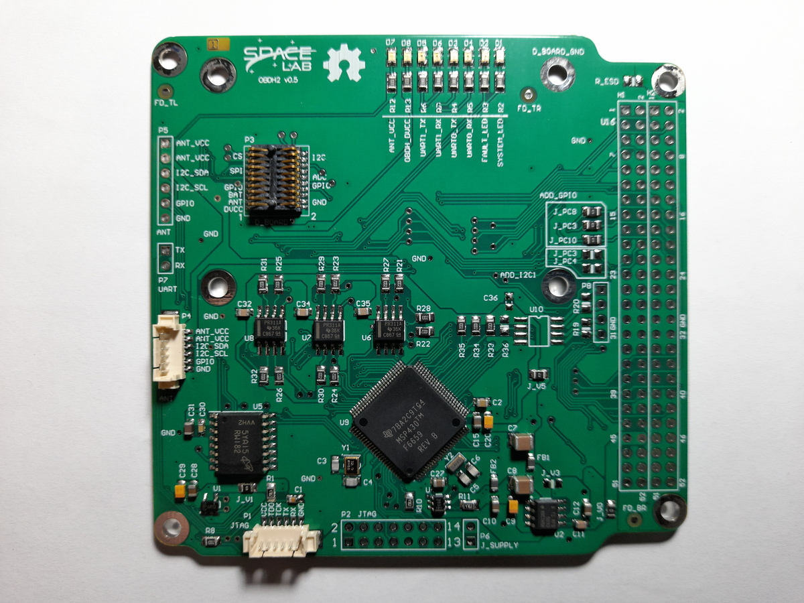
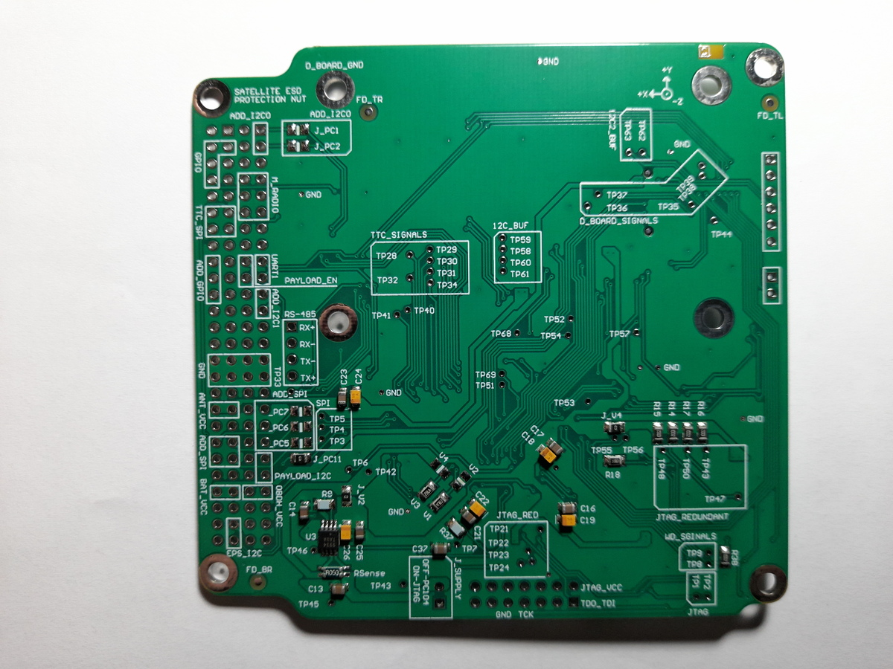
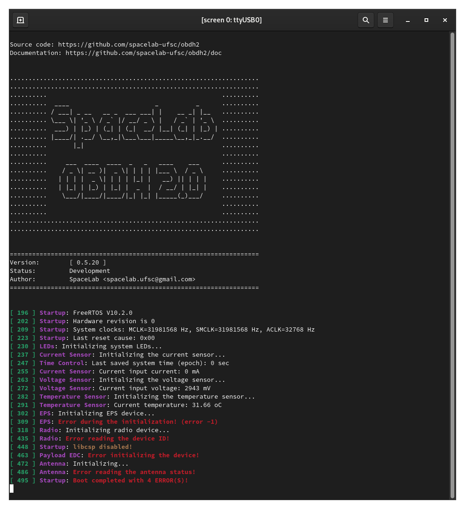
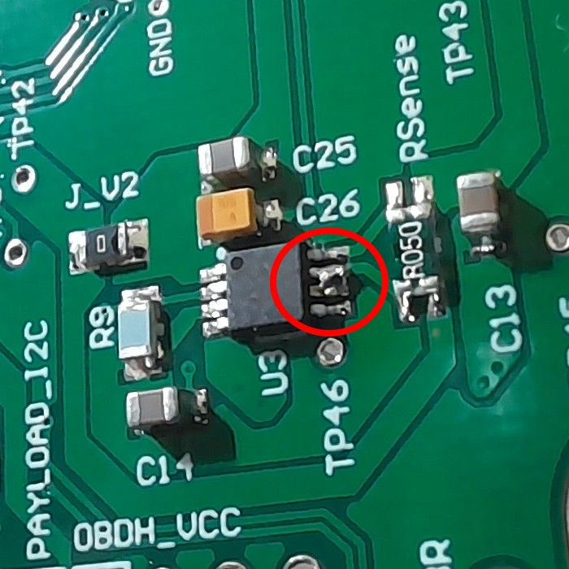
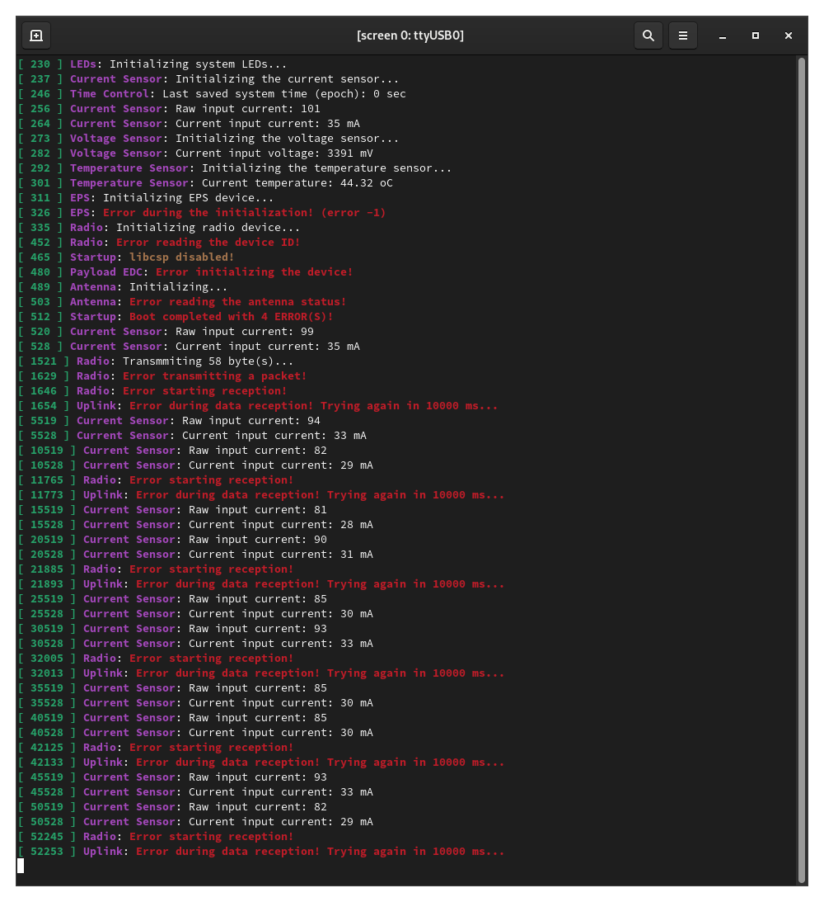

.. test_report_v05.rst

   Copyright The OBDH 2.0 Contributors.

   OBDH 2.0 Documentation

   This work is licensed under the Creative Commons Attribution-ShareAlike 4.0
   International License. To view a copy of this license,
   visit http://creativecommons.org/licenses/by-sa/4.0/.

.. _anx:test-report-v05:

Test Report of v0.5 Version
===========================

This appendix is a test report of the first manufactured and assembled PCB (version v0.5).

- **PCB manufacturer**: PCBWay (China)

- **PCB assembly**: PCBWay (China)

- **PCB arrival date**: 2021/04/14

- **Execution date**: 2021/04/16 to TBC

- **Tester**: G. M. Marcelino

Visual Inspection
-----------------

- **Test description/Objective**: Inspection of the board, visually and with a multimeter, searching for fabrication and assembly failures.

- **Material**:

  - Multimeter UNI-T DT830B

- **Results**: The results of this test can be seen in Figures :numref:`fig:obdh2-v05-top` (top view of the board) and :numref:`fig:obdh2-v05-bottom` (bottom view of the board).

- **Conclusion**: No problems were identified on this test.

   Top view of the OBDH 2.0 v0.5 board.

   Bottom view of the OBDH 2.0 v0.5 board.

Firmware Programming
--------------------

- **Test description/Objective**: Inspection of the board, visually and with a multimeter, searching for fabrication and assembly mistakes.

- **Material**:

  - Code Composer Studio v9.3.0

  - MSP-FET Flash Emulation Tool

  - USB-UART converter

  - Screen (Linux software)

- **Results**: The results of this are available in :numref:`fig:log-first-boot`, where the log messages of the first boot of the board can be seen.

- **Conclusion**: No problems were identified on this test.

   Log messages during the first boot.

Communication Busses
--------------------

- **Test description/Objective**: Test the communication busses of the board, as listed below:

  - I\ :math:`^{2}`\ C Port 0

  - I\ :math:`^{2}`\ C Port 1

  - I\ :math:`^{2}`\ C Port 2

- **Material**:

  - Saleae Logic Analyzer (24 MHz, 8 channels)

  - Saleae Logic software (v1.2.18)

  - MSP-FET Flash Emulation Tool

- **Results**: The results of this test can be seen in Figures :numref:`fig:test-i2c-0`, :numref:`fig:test-i2c-1` and :numref:`fig:test-i2c-2`.

- **Conclusion:** No problems were identified on this test, all buses are working as expected.

.. subfigure:: AB
   :layout-sm: A|B
   :gap: 8px
   :subcaptions: below
   :name: fig:test-i2c-0
   :class-grid: outline
   :align: center

   .. image:: img/v05/test-i2c-0.jpg
      :width: 100%
      :align: center
      :alt: Connections of the I2C port 0 test.

   .. image:: img/v05/waveform-i2c-0.png
      :width: 100%
      :align: center
      :alt: Waveforms of the I2C port 0 test.

   I2C port 0 test.

.. subfigure:: AB
   :layout-sm: A|B
   :gap: 8px
   :subcaptions: below
   :name: fig:test-i2c-1
   :class-grid: outline
   :align: center

   .. image:: img/v05/test-i2c-1.jpg
      :width: 100%
      :align: center
      :alt: Connections of the I2C port 1 test.

   .. image:: img/v05/waveform-i2c-1.png
      :width: 100%
      :align: center
      :alt: Waveforms of the I2C port 1 test.

   I2C port 1 test.

.. subfigure:: AB
   :layout-sm: A|B
   :gap: 8px
   :subcaptions: below
   :name: fig:test-i2c-2
   :class-grid: outline
   :align: center

   .. image:: img/v05/test-i2c-2.jpg
      :width: 100%
      :align: center
      :alt: Connections of the I2C port 2 test.

   .. image:: img/v05/waveform-i2c-2.png
      :width: 100%
      :align: center
      :alt: Waveforms of the I2C port 2 test.

   I2C port 2 test.

Sensors
-------

Input Voltage
~~~~~~~~~~~~~

- **Test description/Objective**: .

- **Material**:

  - Code Composer Studio v9.3.0

  - MSP-FET Flash Emulation Tool

  - USB-UART converter

  - Screen (Linux software)

- **Results**: .

- **Conclusion:** .

Input Current
~~~~~~~~~~~~~

- **Test description/Objective**: .

- **Material**:

  - Code Composer Studio v9.3.0

  - MSP-FET Flash Emulation Tool

  - USB-UART converter

  - Screen (Linux software)

- **Results**: .

- **Conclusion:** .

.. subfigure:: ABC
   :layout-sm: A|B|C
   :gap: 8px
   :subcaptions: below
   :name: fig:current-sensing-error-v05
   :class-grid: outline
   :align: center

   .. image:: img/v05/current-sensor-circuit.png
      :width: 100%
      :align: center
      :alt: Current sensing circuit.

   .. image:: img/v05/max9934-top-view.png
      :width: 100%
      :align: center
      :alt: MAX9934 pinout.

   .. image:: img/v05/current-sensor-layout.png
      :width: 100%
      :align: center
      :alt: Current sensing layout on the bottom layer.

   Current sensing circuit, pinout, and PCB layout.

   Current sensor fix.

   Log messages with the read values from the current sensor.

Peripherals
-----------

NOR Flash Memory
~~~~~~~~~~~~~~~~

- **Test description/Objective**: Test the functionality of the NOR flash memory by verifying the device ID register of the IC.

- **Material**:

  - Saleae Logic Analyzer (24 MHz, 8 channels)

  - Saleae Logic software (v1.2.18)

  - MSP-FET Flash Emulation Tool

- **Results**: The results of this test can be seen in :numref:`fig:test-nor-memory`.

- **Conclusion:** No problems were identified on this test. As shown in :numref:`fig:test-nor-memory`, the device ID register was read as expected.

.. subfigure:: AB
   :layout-sm: A|B
   :gap: 8px
   :subcaptions: below
   :name: fig:test-nor-memory
   :class-grid: outline
   :align: center

   .. image:: img/v05/test-nor-memory.jpg
      :width: 100%
      :align: center
      :alt: Connections of the NOR flash memory test.

   .. image:: img/v05/waveform-spi-mem.png
      :width: 100%
      :align: center
      :alt: Waveforms of the NOR memory SPI.

   NOR memory SPI test.

Conclusion
----------

Excluding the current sensor issue, no major problems were identified during the executed tests. For the next fabrication round, the identified mistakes will be corrected.
