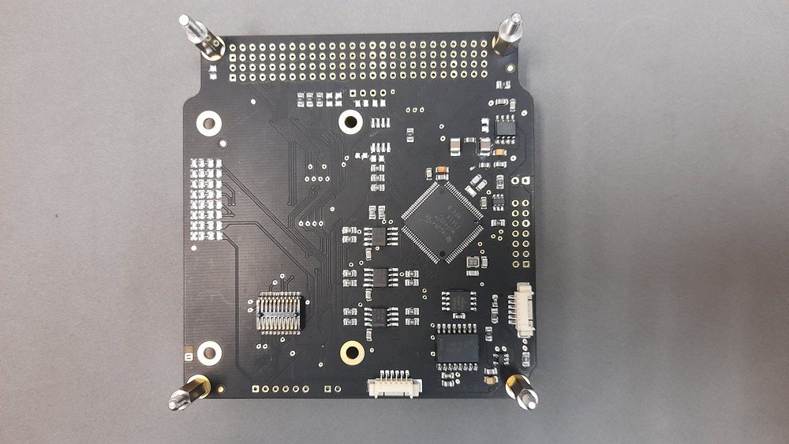
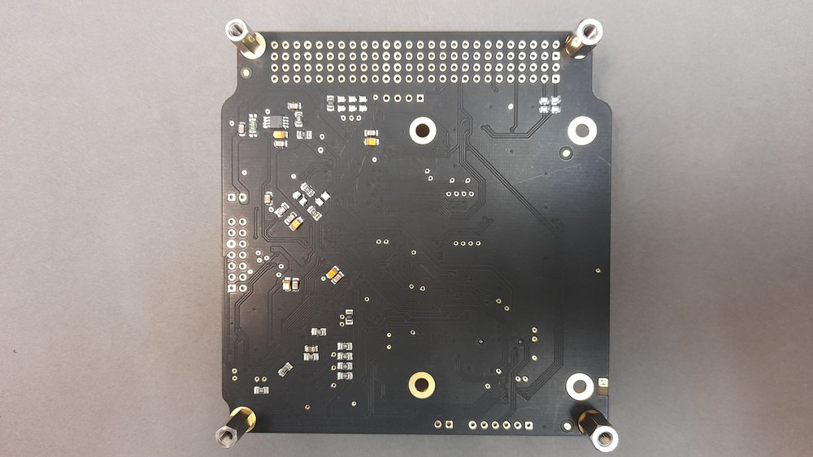
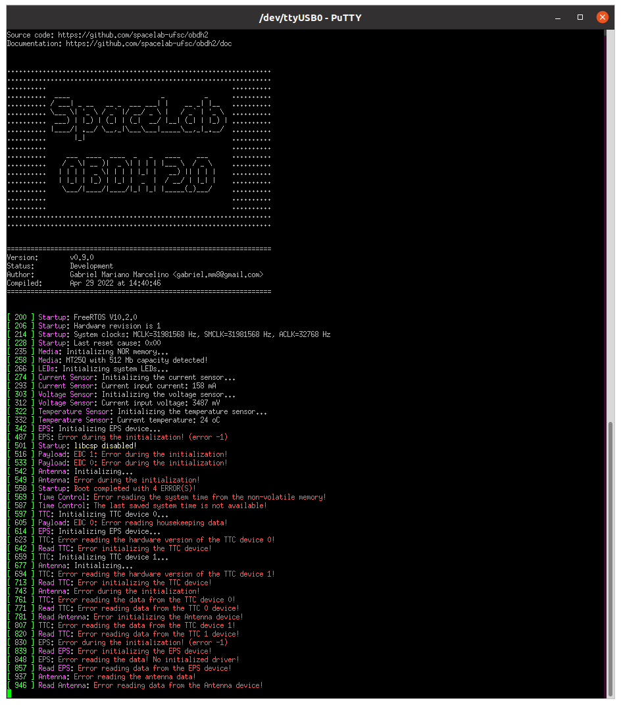
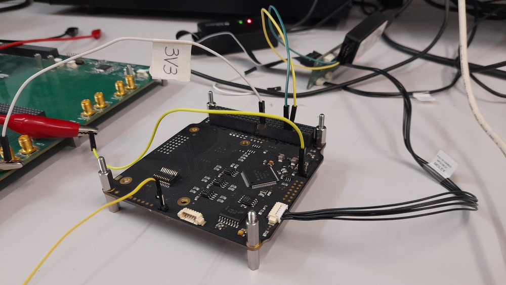
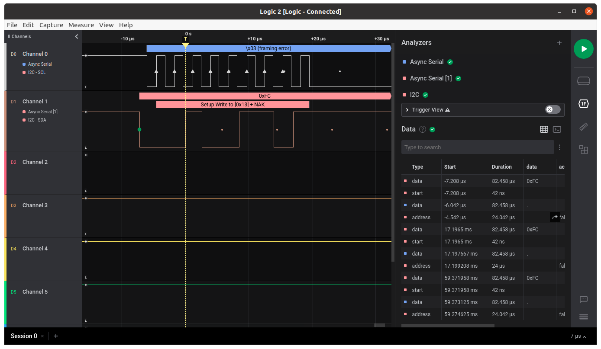
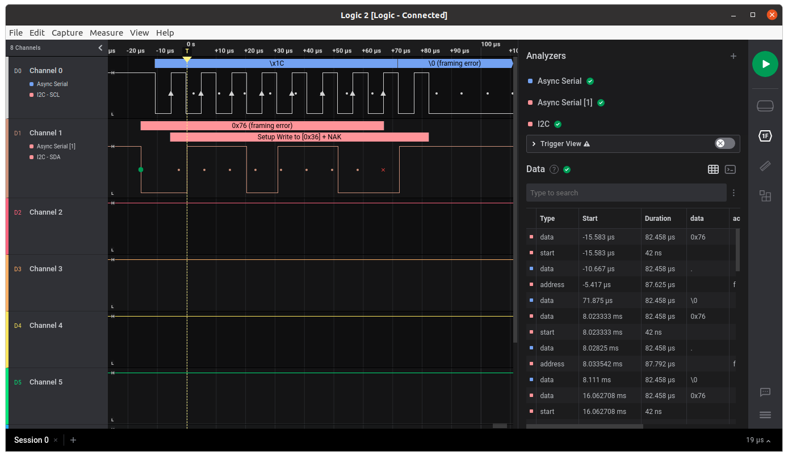
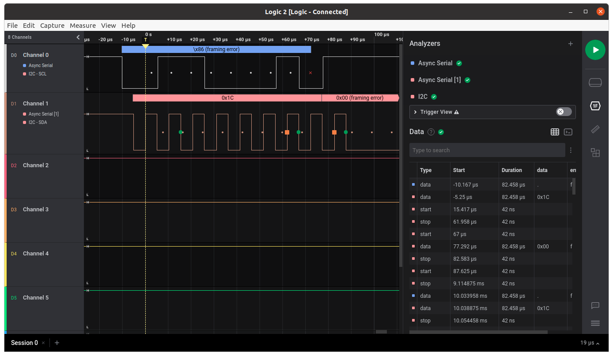
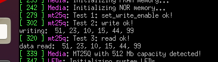

.. test_report_v07.rst

   Copyright The OBDH 2.0 Contributors.

   OBDH 2.0 Documentation

   This work is licensed under the Creative Commons Attribution-ShareAlike 4.0
   International License. To view a copy of this license,
   visit http://creativecommons.org/licenses/by-sa/4.0/.

.. _anx:test-report-v07:

Test Report of v0.7 Version
===========================

This appendix is a test report of the first manufactured and assembled PCB (version v0.7).

- **PCB manufacturer**: PCBWay (China)

- **PCB assembly**: PCBWay (China)

- **PCB arrival date**: 2022/04/18

- **Execution date**: 2022/04/22 to 2022/08/10

- **Tester**: Gabriel M. Marcelino, Vitória B. Bianchin and Bruno Benedetti

- **DNP components**: P8, P2, P5, P6, P7, D1, D2, D3, D4, D5, D6, D7, D8, U10, R19, R20, R_ESD, J_PC3, J_PC4, R2, R3, R4, R5, R6, R7, R12, R13, J_V3, J_PC5, J_PC6, J_PC7, J_PC1, J_PC2, V1, V4, R36, C36

Visual Inspection
-----------------

- **Test description/Objective**: Inspection of the board, visually and with a multimeter, searching for fabrication and assembly failures.

- **Material**:

  - Digital microscope (1000x)

  - Multimeter Fluke 17B+

- **Results**: The results of this test can be seen in Figures :numref:`fig:obdh2-v07-top` (top view of the board) and :numref:`fig:obdh2-v07-bottom` (bottom view of the board).

- **Conclusion**: No problems were identified on this test.

   Top view of the OBDH 2.0 v0.7 board.

   Bottom view of the OBDH 2.0 v0.7 board.

Firmware Programming
--------------------

- **Test description/Objective**: Inspection of the board, visually and with a multimeter, searching for fabrication and assembly mistakes.

- **Material**:

  - Code Composer Studio v11

  - MSP-FET Flash Emulation Tool

  - USB-UART converter

  - PuTTy

- **Results**: The results of this are available in :numref:`fig:v07-log-first-boot`, where the log messages of the first boot of the board can be seen.

- **Conclusion**: No problems were identified on this test.

   Log messages during the first boot.

Communication Busses
--------------------

- **Test description/Objective**: Test the communication busses of the board, as listed below:

  - I\ :math:`^{2}`\ C Port 0

  - I\ :math:`^{2}`\ C Port 1

  - I\ :math:`^{2}`\ C Port 2

- **Material**:

  - Saleae Logic Analyzer (24 MHz, 8 channels)

  - Saleae Logic software (v2)

  - MSP-FET Flash Emulation Tool

- **Results**: The results of this test can be seen in Figures :numref:`fig:v07-test-i2c-0`, :numref:`fig:v07-test-i2c-1` and :numref:`fig:v07-test-i2c-2`.

- **Conclusion:** No problems were identified on this test, all buses are working as expected.

   Setup of the I2C port tests.

   Waveform of the I2C port 0.

   Waveform of the I2C port 1.

   Waveform of the I2C port 2.

Sensors
-------

Input Voltage
~~~~~~~~~~~~~

- **Test description/Objective**: Verify the input voltage measurements of the board.

- **Material**:

  - Code Composer Studio v11

  - MSP-FET Flash Emulation Tool

  - Programmable power supply

  - USB-UART converter

  - Screen (Linux software)

- **Results**: TBC.

- **Conclusion:** The input voltage was measured correctly by the sensor.

Input Current
~~~~~~~~~~~~~

- **Test description/Objective**: Verify the input current measurements of the board.

- **Material**:

  - Code Composer Studio v11

  - MSP-FET Flash Emulation Tool

  - Programmable power supply

  - USB-UART converter

  - Screen (Linux software)

- **Results**: TBC.

- **Conclusion:** The input current was measured correctly by the sensor.

Peripherals
-----------

NOR Flash Memory
~~~~~~~~~~~~~~~~

- **Test description/Objective**: Test the functionality of the NOR flash memory by verifying the device ID register of the IC and performing writing/reading operations.

- **Material**:

  - Code Composer Studio v11

  - MSP-FET Flash Emulation Tool

  - USB-UART converter

  - Screen (Linux software)

- **Results**: The results of this test can be seen in :numref:`fig:v07-nor-test`.

- **Conclusion:** No problems were identified on this test, as can be seen in :numref:`fig:v07-nor-test`, an writing/reading operation were executed with success.

   Test results of the NOR flash memory.

FRAM Memory
~~~~~~~~~~~

- **Test description/Objective**: Test the functionality of the FRAM memory by verifying the device ID register of the IC and performing writing/reading operations.

- **Material**:

  - Code Composer Studio v11

  - MSP-FET Flash Emulation Tool

  - USB-UART converter

  - Screen (Linux software)

- **Results**: The results of this test can be seen in :numref:`fig:v07-fram-test`.

- **Conclusion:** No problems were identified on this test.

.. subfigure:: AB
   :layout-sm: A|B
   :subcaptions: below
   :name: fig:v07-fram-test

   .. image:: img/v07/obdh2-v07-fram-results1.png
      :alt: First FRAM memory test result.

   .. image:: img/v07/obdh2-v07-fram-results2.png
      :alt: Second FRAM memory test result.

   Test results of the FRAM memory.

Conclusion
----------

No major problems were identified during the executed tests, all peripherals all working as expected.
